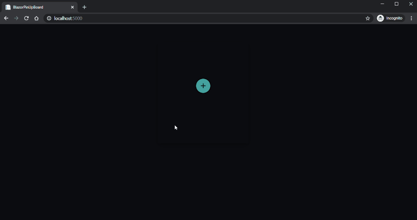

## Run
1. Install the [.NET Core 3.1 SDK](https://dotnet.microsoft.com/download/dotnet-core/3.1).
2. ``` git clone https://github.com/foofaraw/blazor-poc.git ```
3. ``` cd blazor-poc/src/BlazorPinUpBoard```
4. ``` dotnet run ```
5. Go to http://localhost:5000
